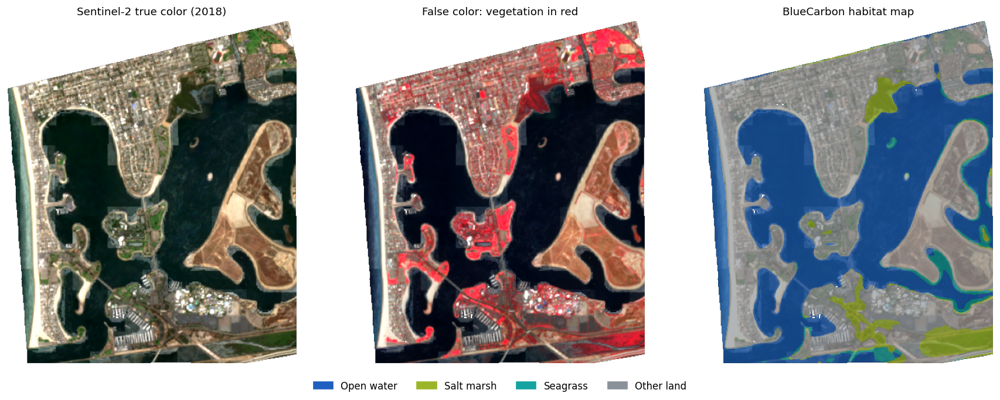

# BlueCarbon-AI

[](https://github.com/yanicksanchez14-creator/bluecarbon-ai/actions/workflows/ci.yml)
[](https://bluecarbon-ai.streamlit.app)
[](https://colab.research.google.com/github/yanicksanchez14-creator/bluecarbon-ai/blob/main/notebooks/train_colab.ipynb)


**Deep-learning maps of blue carbon ecosystems (mangrove, salt marsh and seagrass) from Sentinel-2
satellite imagery, with carbon stock and sequestration estimates that show their uncertainty.**

Coastal wetlands store carbon per hectare several times faster than terrestrial forests, and they are
being lost fast. BlueCarbon-AI goes from a map rectangle to a habitat map and a carbon report:

```
draw an area ─► Sentinel-2 composite ─► U-Net segmentation ─► error-adjusted areas ─► IPCC Tier 1 carbon ± uncertainty
```



## Highlights

- **End-to-end geospatial pipeline.** Earth Engine → Cloud Score+ masking → seasonal composites → tiled
  download of any area size in the local UTM zone. It runs from one CLI and one YAML config.
- **Reference labels you can defend.** Labels are fused from ESA WorldCover, the Murray global
  intertidal maps and the Allen Coral Atlas across **11 sites on 4 continents**, rather than drawn by
  hand for a single bay.
- **Evaluation that can't cheat.** Chips never overlap, whole 5 km blocks go to a single split, and two
  entire estuaries are held out for testing. Metrics are per-class IoU/F1, not headline pixel accuracy.
- **Modern segmentation.** U-Net / ResNet-34 (`segmentation-models-pytorch`), 14-channel spectral input,
  Dice + weighted cross-entropy, mixed precision, overlap-blended inference with test-time augmentation.
- **Honest carbon numbers.** Areas are corrected for map bias with the Olofsson et al. (2014) estimator,
  and IPCC Tier 1 coefficients are run through Monte Carlo sampling to give 90% intervals. Credit value
  is based on sequestration, not standing stock.
- **Live web app.** Explore mapped sites with no login, or (with Earth Engine credentials) map any
  coastline on demand and download the GeoTIFF + report.
- **Engineering.** Installable package, typed config, self-describing model checkpoints, pytest suite
  covering an offline end-to-end run, and GitHub Actions CI.

## Results

### Pilot (shipping in the demo today)
The pilot model is trained only on the original hand-labelled Mission Bay scene and evaluated with
leave-one-block-out **spatial** cross-validation:

| Class | IoU | F1 |
|---|---:|---:|
| Open water | 0.92 | 0.96 |
| Other land | 0.95 | 0.97 |
| Salt marsh | 0.13 | 0.23 |
| Seagrass | 0.00 | 0.00 |
| **mIoU / macro-F1** | **0.50** | **0.54** |

Overall pixel accuracy is **94%**, and salt marsh is still mostly missed. A single bay doesn't have
enough blue carbon pixels to learn from, which is why v2 is built around multi-site training data.
[`docs/AUDIT.md`](docs/AUDIT.md) covers what v1 got wrong and how v2 fixes it.

### v2 multi-site model
Train it yourself in about an hour on a free Colab GPU: [`notebooks/train_colab.ipynb`](notebooks/train_colab.ipynb).
The notebook writes held-out test metrics, per-site scores and a confusion matrix, and exports new
demo sites (Mission Bay 2018→2024 change, Moreton Bay, Tampa Bay).

## Quick start

```bash
git clone https://github.com/yanicksanchez14-creator/bluecarbon-ai.git && cd bluecarbon-ai
pip install -e ".[gee,app,dev]"

streamlit run app/streamlit_app.py          # demo app, no credentials needed
pytest -q                                   # offline end-to-end test on synthetic scenes
```

Full pipeline (needs an [Earth Engine](https://earthengine.google.com/) project, set `project:` in `configs/default.yaml`):

```bash
earthengine authenticate
bluecarbon fetch                            # imagery + fused labels for every site in configs/sites.yaml
bluecarbon chips                            # leakage-free spatial split
bluecarbon train                            # -> runs/default/model/{model.pt, metrics.json}

# map any coastline and get a carbon report
bluecarbon scene --bbox -117.265 --bbox 32.745 --bbox -117.185 --bbox 32.81 \
                 --start 2024-05-01 --end 2024-09-30 -m runs/default/model/model.pt --name mission_bay
bluecarbon case-study -m runs/default/model/model.pt   # 2018 -> 2024 change analysis
```

## Project structure

```
src/bluecarbon/
  gee.py        Earth Engine composites, fused reference labels, tiled download
  features.py   bands -> reflectance + NDVI / NDWI / MNDWI / NDMI, normalization
  labels.py     boundary buffering, survey-polygon overrides
  tiling.py     non-overlapping chips, spatial-block splits
  model.py      smp models + self-describing checkpoints
  train.py      Dice+CE, class weighting, AMP, early stopping, held-out evaluation
  predict.py    overlap-blended sliding-window inference + TTA
  metrics.py    IoU / F1 / kappa, Olofsson error-adjusted area
  carbon.py     IPCC Tier 1 stocks & sequestration, Monte Carlo intervals
  demo.py       export scenes for the web app
  cli.py        `bluecarbon` command
app/            Streamlit demo
configs/        pipeline + site definitions
notebooks/      Colab training notebook
docs/           methodology, v1 audit, figures
```

## Deploy the live demo

1. On [share.streamlit.io](https://share.streamlit.io), click **Create app**, then pick this repo, branch
   `main`, and main file `app/streamlit_app.py`. Set the URL to `bluecarbon-ai`.
2. *(Optional, enables "Analyze an area".)* In Google Cloud, create a service account in the Earth
   Engine project, grant it **Earth Engine Resource Viewer** + **Service Usage Consumer**, register it for
   Earth Engine, create a JSON key, and paste it as the `GEE_SERVICE_ACCOUNT` secret
   (see `.streamlit/secrets.example.toml`).
3. *(After training v2.)* Attach `model.pt` to a GitHub Release and set `MODEL_URL` to its download URL.

## Methodology & limitations

See [`docs/METHODOLOGY.md`](docs/METHODOLOGY.md). In short: Tier 1 carbon values are global averages
and give order-of-magnitude estimates. Temperate seagrass needs local survey labels, and tides affect
what the satellite sees in intertidal zones. **This is a research tool, not a carbon-credit
methodology.**

## Citation / data credits

Sentinel-2 (ESA Copernicus) · Cloud Score+ (Google) · ESA WorldCover 2021 · Murray et al. global
intertidal · Allen Coral Atlas · NASADEM · IPCC 2013 Wetlands Supplement.

---
Built by **Yanick Sanchez**. v1 (2025) was an independent first attempt, and v2 (2026) is a ground-up rebuild.
